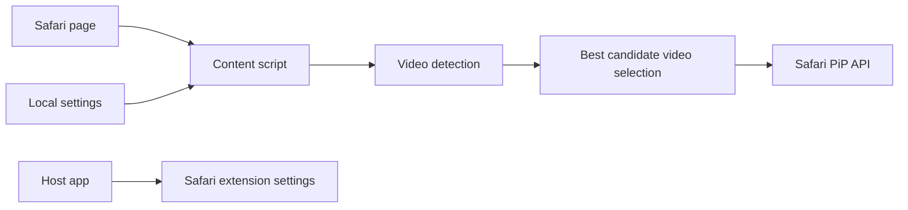

# PopPiP

<div align="center">
  
</div>

<div align="center">

<h3>Keep the video in view.</h3>
<h3>Keep your flow.</h3>

</div>

<p align="center">
  PopPiP gives Safari videos a cleaner, smoother Picture-in-Picture experience on macOS.
</p>

<div align="center">

[](https://www.apple.com/macos/)
[](https://swift.org)
[](https://developer.apple.com/xcode/swiftui/)
[](LICENSE)
[](https://github.com/luccahora/PopPiP/issues)
[](https://github.com/luccahora/PopPiP/stargazers)

</div>

<div align="center">

Minimal. Private. Safari-native.

</div>

## Overview

PopPiP helps videos feel like a native part of your workflow. Start a clip, switch tabs, jump to another app, and keep the content in view without interrupting the work you were already doing.

## Why PopPiP?

Picture-in-Picture is great, but many players and websites do not make it easy to trigger or manage consistently. PopPiP keeps that experience lightweight: detect the active video, pick the right one, and move it into PiP when the page loses focus or the user leaves the active context.

## Features

The current codebase includes:

- Automatic PiP when a Safari tab becomes hidden
- Automatic PiP when Safari loses focus while the app remains active
- Optional PiP when a playing video leaves the visible viewport
- Smart selection of the most relevant `video` element on the page
- Per-site allowlist and denylist with local settings
- Optional "enable on all allowed sites" behavior
- Local-only storage and debug logging that stays off by default
- Native macOS app plus Safari Web Extension
- English and Brazilian Portuguese interface support
- No account, backend, or analytics requirement

The project is built around Safari and supported HTML5 video players such as YouTube, Twitch, Vimeo, and standards-based `<video>` elements. It does not scrape metadata or depend on external service APIs.

## Privacy

PopPiP is designed to stay local to the user's Mac.

Confirmed behaviors from the code and project docs:

- no analytics or telemetry
- no account system
- no backend or automatic network requests
- no browsing-history collection
- no video-title or page-content scraping
- settings remain local in browser storage
- Safari website access is required only for local video detection on sites the user explicitly allows

The extension reads playback and layout state only to decide whether a video is eligible for PiP. It does not store the full URL, page text, form contents, cookies, or personal data. See [PRIVACY.md](PRIVACY.md) for the full project policy.

## Requirements

| Requirement | Status |
| --- | --- |
| macOS minimum | 14.0 |
| Swift version | 5.0 |
| UI framework | SwiftUI |
| Browser | Safari on macOS |
| Build tooling | Xcode project (`PopPiP.xcodeproj`) |
| Test tooling | Node.js built-in test runner |

Notes:

- The project targets macOS 14.0 and newer.
- It is built for Safari and not intended as a cross-browser tool.
- There are no external runtime package dependencies in the app logic.
- Node is used only for lightweight validation tests.

## Installation

### Users

The project is prepared for GitHub Releases as the public distribution channel for the macOS app. A release is published from a tagged version, and the asset is expected to be a signed or notarized `.app`/zip bundle prepared for end-user installation.

Once a release is available, the expected flow is:

1. Download the signed build from the GitHub Releases page.
2. Launch the app.
3. In Safari, go to Settings → Extensions and enable PopPiP.
4. Grant Safari website access to the sites you want to use.
5. Open the PopPiP toolbar popup and enable the site.

A Mac App Store version remains a future distribution option, but the GitHub release flow is the current public channel for the initial launch.

### Developers

```sh
git clone https://github.com/luccahora/PopPiP.git
cd PopPiP
open PopPiP.xcodeproj
```

Then:

1. Open the project in Xcode.
2. Select the `PopPiP` scheme and a local Mac destination.
3. Ensure your development team is assigned for the app and extension targets.
4. Build and run the app.
5. Enable the extension in Safari via Settings → Extensions.
6. Grant website access for the domains under test.

Run the project tests:

```sh
node --test tests/*.test.js
```

Unsigned command-line build check:

```sh
xcodebuild -project PopPiP.xcodeproj -scheme PopPiP -configuration Debug \
  -derivedDataPath DerivedData CODE_SIGNING_ALLOWED=NO build
```

## Usage

1. Launch PopPiP.
2. Enable the Safari extension in Safari settings.
3. Open a supported site and start a compatible video.
4. Grant Safari website access when prompted.
5. Switch tabs or apps and PopPiP will trigger PiP when enabled.
6. Return to the page and PopPiP will close the automatically started PiP if it is still the active auto-PiP state.

The current project exposes a Safari popup and local settings; there is no custom global keyboard shortcut implemented in the codebase.

## How it works



The content script:

- watches for page visibility and focus changes
- checks whether the site is enabled locally
- selects the best playing video on the page
- calls Safari's supported PiP API (`webkitSetPresentationMode` preferred; `requestPictureInPicture` as fallback)
- restores the page when auto-PiP is closed by PopPiP itself

The host app provides the macOS-side entry point and links users to Safari extension settings while keeping the privacy model local-first.

## Project structure

```text
PopPiP/
├── PopPiP/                          # Native macOS app
│   ├── Assets.xcassets/            # App icons and resources
│   ├── Views/                      # SwiftUI views
│   ├── Info.plist                  # App bundle metadata
│   ├── PopPiPApp.swift             # App entry point
│   └── PopPiP.entitlements         # App sandbox settings
├── PopPiP Extension/               # Safari Web Extension target
│   ├── Resources/                  # JS, CSS, manifest and icons
│   ├── Info.plist                  # Extension metadata
│   └── PopPiP_Extension.entitlements
├── Shared/                         # Shared project metadata
├── tests/                          # Node.js validation tests
├── docs/                           # Compatibility, privacy and release notes
├── BrandAssets/                    # Official app icon and art assets
├── package.json                    # Minimal Node test script
├── CONTRIBUTING.md                 # Contribution guide
├── PRIVACY.md                      # Privacy policy
├── SECURITY.md                     # Security policy
├── LICENSE                         # MIT license
├── CHANGELOG.md                    # Changelog
├── README.md                       # Project overview
├── PopPiP.xcodeproj                # Xcode project
├── PRIVACY_MANIFEST.md             # Privacy manifest assessment
├── TRADEMARKS.md                  # Trademark guidance
├── .github/                        # Issue templates and PR template
└── docs/assets/poppip-logo.png    # Official project logo for docs
```

## Architecture

PopPiP keeps a small, clear separation of responsibilities:

- App layer: native SwiftUI host app for macOS
- Extension layer: Safari Web Extension that runs on eligible pages
- Core logic: JavaScript that detects and selects the best video and governs PiP transitions
- Storage: local browser storage for allow/deny rules and preferences
- OS integration: Safari settings and the app UI guide the user through enabling the extension

This split keeps the app lightweight while still using the Safari native lifecycle and PiP APIs.

## Development

PopPiP is intentionally simple to work on:

- SwiftUI for the host app
- JavaScript for the content script and selection logic
- minimal Node-based test coverage
- no external runtime package dependencies
- no remote backend or custom updater

Useful commands:

```sh
# Run validation tests
node --test tests/*.test.js

# Build without signing
xcodebuild -project PopPiP.xcodeproj -scheme PopPiP -configuration Debug \
  -derivedDataPath DerivedData CODE_SIGNING_ALLOWED=NO build
```

## Testing

The repository includes focused tests for the PiP decision logic, including:

- selecting the active video on a page
- ignoring paused, ended, or tiny videos
- support detection for Safari PiP-capable players
- automatic PiP state transitions
- allowlist and denylist behavior

Run them with:

```sh
node --test tests/*.test.js
```

The project does not currently include a broad UI automation suite, and the Safari validation checklist in [docs/SAFARI_COMPATIBILITY_CHECKLIST.md](docs/SAFARI_COMPATIBILITY_CHECKLIST.md) remains the best source for real-world compatibility checks before release.

## Permissions

PopPiP's permissions are intentionally minimal and user-governed.

| Permission / access | Why it exists |
| --- | --- |
| Safari website access | Lets the extension know whether a site is allowed and monitor video elements on that page |
| `storage` | Saves settings and hostname rules locally |
| `activeTab` | Allows the extension to understand the current tab after the user clicks the toolbar item |
| `http://*/*` and `https://*/*` content scripts | Required for video detection and visibility/focus event monitoring on supported pages |
| App sandbox | Keeps the app and extension isolated and local-first |

There are no extra app entitlements beyond the sandbox at the project level.

## Security

See [SECURITY.md](SECURITY.md) for vulnerability reporting guidance.

The current implementation follows a privacy-first and local-first model:

- no outbound analytics or tracking
- no custom updater or background service
- no secret or signing material in the repository
- no external SDKs or third-party code in the core flow
- no hidden network calls in the active runtime path

## Roadmap

The following items are planned or are clearly future-facing rather than fully implemented today:

- broader Safari compatibility validation across more sites and players
- public release builds and signed distribution
- App Store release planning
- more demo assets and release screenshots
- additional polishing for the Safari popup and settings experience
- deeper validation for DRM-heavy and embedded players

This repository is transparent about compatibility limits rather than claiming universal support for every player or website.

## Contributing

Contributions are welcome. Please keep changes focused, readable, and consistent with the project's privacy model.

For the full workflow, see [CONTRIBUTING.md](CONTRIBUTING.md).

A good first contribution can be:

- Safari compatibility validation
- architecture and UX refinements
- permission and behavior fixes
- documentation and release preparation

## Feedback & feature requests

Use GitHub Issues for bugs and improvements:

- [Open an issue](https://github.com/luccahora/PopPiP/issues)
- [Feature request template](.github/ISSUE_TEMPLATE/feature_request.yml)

Bug reports should include the macOS version, Safari version, reproduction steps, expected behavior, and actual behavior. Keep the report focused and avoid posting secrets or private information.

## License

PopPiP is available under the [MIT License](LICENSE).

## Open Source & official distribution

PopPiP is open source and developed on GitHub, but its official distribution may also include signed macOS builds or an App Store path for end users.

That model is not contradictory:

- the source code remains open and inspectable
- users can build locally if they want
- a signed official build may still be distributed through a dedicated channel for convenience and update management

This repository does not currently advertise a published App Store build, and the App Store path remains a planned distribution option rather than a confirmed release status.

## Disclaimer

PopPiP depends on Safari's native browser behavior and the capabilities of each site or player. Some websites may restrict PiP because of DRM, embed policies, or Safari permissions. PopPiP is not affiliated with Apple, Safari, or any third-party video provider.

## Acknowledgements

This project is inspired by the idea of making Picture-in-Picture easier to access on macOS. It is a standalone implementation built for Safari and the PopPiP project itself.

## Footer

Made for people who want to keep the video in view without losing the rest of their workflow.
